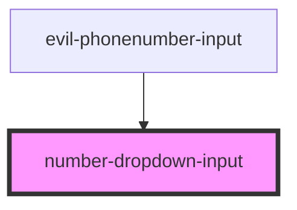

# number-dropdown-input

<!-- Auto Generated Below -->

## Properties

| Property     | Attribute     | Description | Type     | Default     |
| ------------ | ------------- | ----------- | -------- | ----------- |
| `itemNumber` | `item-number` |             | `number` | `undefined` |
| `itemPrefix` | `item-prefix` |             | `string` | `''`        |
| `value`      | `value`       |             | `string` | `undefined` |

## Events

| Event    | Description | Type                  |
| -------- | ----------- | --------------------- |
| `change` |             | `CustomEvent<string>` |

## Dependencies

### Used by

 - [evil-phonenumber-input](../evil-phonenumber-input)

### Graph

----------------------------------------------

*Built with [StencilJS](https://stenciljs.com/)*
