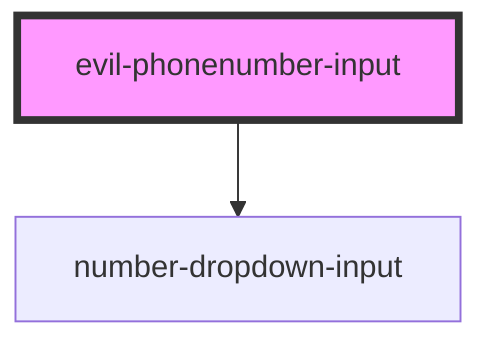

# evil-phonenumber-input

<!-- Auto Generated Below -->

## Properties

| Property | Attribute | Description | Type      | Default     |
| -------- | --------- | ----------- | --------- | ----------- |
| `debug`  | `debug`   |             | `boolean` | `false`     |
| `name`   | `name`    |             | `string`  | `undefined` |
| `value`  | `value`   |             | `string`  | `undefined` |

## Events

| Event         | Description | Type               |
| ------------- | ----------- | ------------------ |
| `valueChange` |             | `CustomEvent<any>` |

## Dependencies

### Depends on

- [number-dropdown-input](../number-dropdown-input)

### Graph

----------------------------------------------

*Built with [StencilJS](https://stenciljs.com/)*
